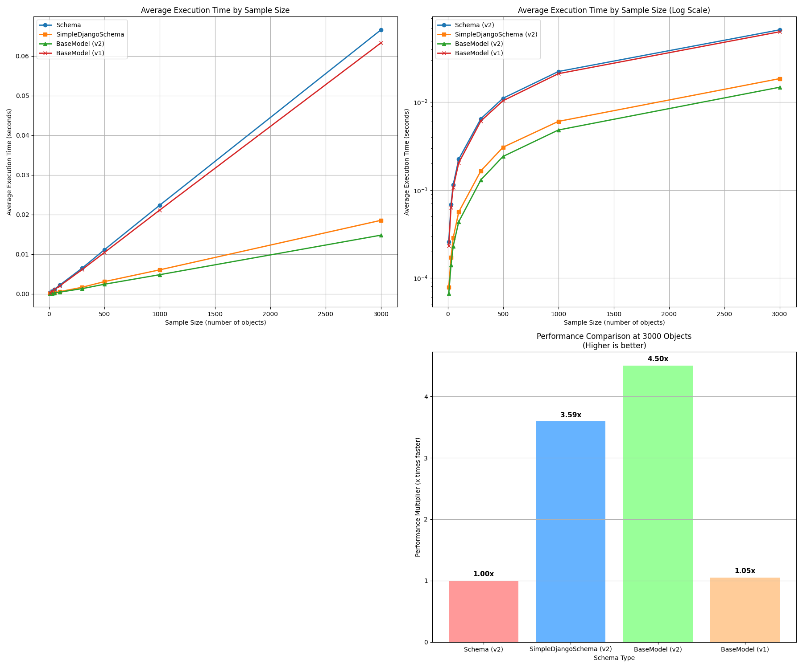

# Django Ninja Pydantic Benchmark

This repository contains benchmarking code to compare the performance of different schema validation approaches in Django Ninja and Pydantic.

## Overview

This benchmark compares the performance of:

1. **Django Ninja Schema**: The standard Schema class from django-ninja
2. **SimpleDjangoSchema**: A simplified version of Django Schema with resolver logic removed
3. **Pydantic BaseModel (v2)**: The current version of Pydantic's BaseModel
4. **Pydantic BaseModel (v1)**: The previous version of Pydantic's BaseModel

The benchmark measures serialization/deserialization performance with different data sizes to help developers make informed decisions about which schema approach to use for optimal performance.

## Key Findings

- Pydantic v2 (BaseModel) is significantly faster than both Pydantic v1 and Django Ninja Schema
- The performance difference becomes more pronounced with larger data sizes
- SimpleDjangoSchema offers improved performance over the standard Schema
- Visualizations clearly show the relative performance differences

## Requirements

- Python 3.8+
- Django
- Django Ninja
- Pydantic (both v1 and v2)
- Matplotlib (for visualization)

## How to Run

1. Clone the repository:
```bash
git clone https://github.com/BEMELON/django-ninja-pydantic-benchmark.git
cd django-ninja-pydantic-benchmark
```

2. Install the required dependencies:
```bash
pip install -r requirements.txt
```

3. Run the benchmark:
```bash
python benchmark_code.py
```

The script will run benchmarks for different sample sizes and display the results, including visualizations.

## Customization

You can adjust the following parameters in the script:

- `SAMPLE_SIZES`: List of sample sizes to test (number of objects)
- `ITERATIONS`: Number of times to repeat each test for more reliable results

## Visualization

The benchmark generates several visualizations:

1. Average execution time by sample size
2. Log-scale execution time for better comparison of values with different magnitudes
3. Performance multiplier bar graph showing how many times faster each implementation is

## Contributing

Contributions are welcome! Feel free to open issues or submit pull requests to improve the benchmarks or add more validation approaches.

## Sample Output 

